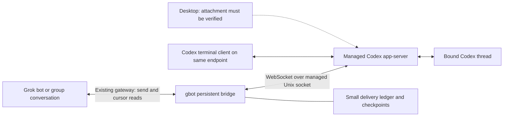

# Grok Bot ↔ Codex: managed-daemon messaging architecture

> **Status as of 2026-09-15 (historical):** snapshot against grok-bot-cli 0.4.1 / PR #53. Current product contract on 0.6.x is honest fire-and-forget inject via the managed app-server control socket — not a live duplex session. Read this as design notes, not the live claim.


**Recommendation date:** September 15, 2026  
**Repository:** `ScriptedAlchemy/grok-bot-cli`, `e368ecf5fff848a789f332629a5e4290d07f5b4d`  
**Verified local version:** grok-bot-cli 0.4.1; managed Codex CLI and app-server 0.154.0

## Recommendation

**Make `gbot` a persistent, explicitly bound client of the existing managed Codex daemon.** Keep one connection open, resume selected threads, consume their events, and deliver Codex replies back to the bound Grok conversation. Reuse the existing Grok gateway and transcript cursor machinery. Start with a foreground `gbot codex bridge run`; add service installation only after recovery works.

Keep the managed Unix socket as the default. Keep `send` as a bounded one-shot operation, add `watch` and `send --wait`, and build continuous bridging on the same session implementation. Use dedicated Codex threads for unattended exchanges; support shared human threads with explicit busy behavior and responder ownership.

**Do not make disabling `codex-app-tools` a prerequisite.** It removes access to app-provided agent tools and does not establish that Desktop joined the managed daemon. Treat the current disabled setting as a diagnostic workaround or a deliberate feature tradeoff. Prefer restoring it for normal Desktop use once its actual capability impact has been checked.

**Honest duplex claim:** app-server supports bidirectional protocol traffic. A bridge can automatically return Codex output and bring new Grok messages into Codex. With the currently inspected Grok interface, inbound Grok delivery still uses polling. Neither a socket notification nor an MCP notification automatically wakes an idle model. The bridge must start a turn, explicitly steer one, or arrange a queued submission.

There is a useful path available now, independent of Desktop attachment: run the bridge against the managed daemon and use a Codex terminal client explicitly connected to that same endpoint. Desktop becomes an additional client when its attachment is verified.

## 1. What the evidence establishes

### Verified on this Mac during this review

| Check | Result | What it establishes |
| --- | --- | --- |
| Repository HEAD and package | PR #53 commit `e368ecf`; package 0.4.1 | The report addresses the merged bridge implementation. |
| `codex app-server daemon version` | Running; CLI and app-server 0.154.0; managed standalone binary | A managed daemon exists and its version matches the repository's pin. |
| Control socket | `~/.codex/app-server-control/app-server-control.sock`, mode `0600` | The expected user-owned local endpoint exists. |
| Two simultaneous direct clients | Both initialized successfully and independently returned two loaded threads | Multiple connections to this daemon work. This was a metadata-only probe. |
| Process snapshot | Managed `app-server --listen unix://` and its management loop; no matching Desktop private app-server | The private process was absent at inspection time. |
| Plugin configuration | `[plugins."codex-app-tools@openai-bundled"] enabled = false` | The user-level setting is present. |
| Launch environment | `CODEX_APP_SERVER_USE_LOCAL_DAEMON=1` | The launchctl setting is present; consumption by Desktop is unverified. |
| Installed protocol generation | Generated both default and `--experimental` TypeScript definitions from 0.154.0 | The API names and fields below come from the installed binary. |
| `app-server proxy` probe | Raw HTTP Upgrade received `101 Switching Protocols`; plain JSONL initialization timed out | Proxy tunnels the socket byte stream; it does not translate it into JSONL. |

**Not established:** Desktop is a subscriber to this daemon; two clients receive the same active turn's complete event stream; approval arbitration across those clients; queue persistence across daemon restart; autonomous queue draining; or a complete Grok→Codex→Grok exchange. This review did not start model turns, send Grok messages, restart services, or change user configuration.

The terminal/app-server architecture is supported by the official [App Server documentation](https://learn.chatgpt.com/docs/app-server). Local source and generated schemas provide the version-specific evidence throughout this report.

### What the current implementation leaves out

In [`connectCodexAppServer`](https://github.com/ScriptedAlchemy/grok-bot-cli/blob/e368ecf5fff848a789f332629a5e4290d07f5b4d/src/core/codex-bridge.js#L245):

- Incoming server requests receive an immediate `-32601` response.
- Incoming notifications have no request ID and are discarded.
- The public client exposes `request`, `notify`, and `close`, but no event subscription or request responder.

In [`sendToCodexThreadInner`](https://github.com/ScriptedAlchemy/grok-bot-cli/blob/e368ecf5fff848a789f332629a5e4290d07f5b4d/src/core/codex-bridge.js#L823), the connection closes in `finally` after the submission receipt. This explains fire-and-forget behavior without requiring a different daemon or transport.

**The first change is session lifetime and dispatch, not another transport.**

## 2. Proposed architecture



### One bridge process, one session, explicit bindings

A bridge process should multiplex a small set of configured bindings over one daemon connection. Each binding identifies:

- A specific Grok bot/group conversation.
- A specific Codex thread and expected workspace.
- Which messages are eligible for forwarding.
- Busy behavior, reply behavior, and who answers interactive requests.

Do not subscribe to every historical thread or forward every Desktop answer. Selecting a thread for observation is different from authorizing its contents to be sent to a bot or group.

Keep execution state in Codex and conversation state in Grok. Locally retain only binding configuration, delivery receipts, cursors, deduplication keys, and payloads awaiting a known delivery outcome. Use one small on-disk store; no broker, general orchestration service, or second Codex engine is needed.

This delivery ledger is distinct from a queue of future Codex work. Preserve the repository's current decision to let Codex own execution queues. Any new local busy-message queue would change the existing decision and should be proposed explicitly.

### Session lifecycle

1. Connect to the managed socket and install the message dispatcher immediately.
2. Send `initialize`, await its response, then send `initialized`.
3. For each binding, call `thread/resume` by ID with `excludeTurns: true` and no model, instruction, permission, or workspace overrides.
4. Buffer live events while reconciling recent turns/items against the saved checkpoint.
5. Mark the binding ready after subscription and reconciliation succeed.
6. Stay connected through quiet periods and completed turns. Stop observing with `thread/unsubscribe`; then close when the bridge exits.

The 0.154.0 `ThreadResumeParams` definition explicitly describes rejoining an already-running thread. `thread/read` is useful for inspection; it is not the subscription operation. `thread/loaded/list` reports loaded threads, not attached Desktop clients.

Reconnect with bounded exponential backoff and jitter. Reinitialize and resume the selected threads again. Treat a lost request response as an uncertain delivery, not as permission to repeat the mutation.

### Wire shapes from the installed protocol

Minimal initialization and attachment:

```json
{"id":1,"method":"initialize","params":{"clientInfo":{"name":"gbot","version":"0.4.1"}}}
{"method":"initialized"}
{"id":2,"method":"thread/resume","params":{"threadId":"THREAD_ID","excludeTurns":true}}
```

These are sequential messages: await the initialization response before `initialized` and attachment. Enable `capabilities.experimentalApi` only for a configured feature that needs it.

Starting an idle-thread exchange:

```json
{
  "id":3,
  "method":"turn/start",
  "params":{
    "threadId":"THREAD_ID",
    "clientUserMessageId":"gbot-message-uuid",
    "turnTrigger":"gbot",
    "input":[{"type":"text","text":"The attributed Grok message"}]
  }
}
```

Explicitly steering known active work:

```json
{
  "id":4,
  "method":"turn/steer",
  "params":{
    "threadId":"THREAD_ID",
    "expectedTurnId":"ACTIVE_TURN_ID",
    "clientUserMessageId":"gbot-message-uuid",
    "input":[{"type":"text","text":"The attributed follow-up"}]
  }
}
```

`expectedTurnId` is a required precondition. On mismatch, refresh state and report/reconsider the delivery; never silently convert it into a new turn or interruption.

## 3. Fluid delivery without pretending concurrency is solved

### Grok → Codex

Poll the existing Grok transcript API outside the model, using its cursor/`after` contract. An initial target is a one-second interval while an exchange is active, backing off during inactivity and errors. Measure actual latency before changing that target.

Only forward complete, eligible new messages. Preserve source entry IDs and sender provenance. Recognize the bridge's own posts so they are not immediately fed back into Codex.

The current [`transcriptDelta`](https://github.com/ScriptedAlchemy/grok-bot-cli/blob/e368ecf5fff848a789f332629a5e4290d07f5b4d/src/core/transcript.js#L66) searches a bounded recent page; if the cursor disappears, it returns `gapReset: true`. That is a gap signal, not proof that the entire page is new. Recover older entries if the upstream API supports it; otherwise surface the gap and avoid blind replay. The current inspected code does not establish a supported Grok push subscription.

### Busy policy

| Policy | Behavior | Recommended use |
| --- | --- | --- |
| `reject` | Return a busy receipt; submit nothing | Preserve the existing default, particularly on human threads. |
| `queue` | Use experimental `thread/queue/add` and return its submission ID | Opt-in pilot only until restart/drain behavior is measured. |
| `steer` | Call `turn/steer` with the observed active turn ID | Explicitly enabled collaborative exchanges. |

`turn/start` can steer an already-active turn in this version. A status check followed by `turn/start` therefore has a race with another writer. A bridge-local mutex cannot prevent a human client from starting work between those calls.

For unattended reliability, use a dedicated bound thread with one bridge writer. For shared threads, retain the documented race and distinguish steering from new work in receipts. Do not describe `thread/queue/add` plus `thread/queue/start` as an atomic fix until its competing-writer behavior is tested. Do not default to `turn/interrupt`.

A queued receipt also does not establish future execution. The existing [busy-thread decision record](codex-busy-threads.md) already leaves automatic drain and restart persistence unresolved. A continuous bridge must either establish and implement a drain policy or honestly report that execution is awaiting a starter.

### Codex → Grok

Subscribe to at least:

- `turn/started`, `turn/completed`.
- `item/started`, `item/completed`, `item/agentMessage/delta`.
- `thread/status/changed`, `thread/closed`.
- `serverRequest/resolved` and relevant errors/warnings.

Use deltas for local progress. For default Grok delivery, wait for completed assistant items and the turn's terminal status, then send the associated answer once. Do not publish every token as a new Grok message.

The generated `ThreadItem` includes `agentMessage.text`, `phase`, `delivery`, and optional questions. `phase` may be `commentary`, `final_answer`, or null. Prefer explicit final-answer items; when phase is absent, use a documented fallback after turn completion and identify the ambiguity. Do not equate every completed assistant item with a final answer. Treat explicitly asynchronous questions as a separate interaction flow.

Separate result delivery from terminal status. A failed or interrupted turn can have partial output; a successful turn may have no assistant text. Forward the accurate status and only the intended user-facing content. Keep reasoning, tool logs, and unrelated human messages out of automatic forwarding by default.

For shared threads, track the submissions owned by each binding. A turn may contain both human and Grok inputs, especially after steering; `turnId` alone is not sufficient attribution. Default automatic forwarding to bridge-owned exchanges. Require an explicit policy to mirror broader shared-thread output.

### What “two-way” means here

There are three distinct capabilities:

1. **Transport duplex:** both sides can issue protocol messages over one connection.
2. **Automatic conversation delivery:** the bridge notices a new message or result and forwards it without asking a model to poll.
3. **Model scheduling:** Codex incorporates the message on a new turn, during explicit steering, or after queued work starts.

The proposal provides the first two and makes the third explicit. It does not create concurrent independent turns inside one thread or guarantee instantaneous reasoning interruption.

## 4. Interactive requests and second-client attachment

### Replace blanket refusal before shipping a persistent bridge

The current blanket `-32601` handler is unsuitable for a long-lived shared client. Server requests include command/file/permission approvals, user questions, MCP elicitation, dynamic tool calls, and other client services. Some require a result; they are not progress notifications.

Implement a request dispatcher with method-specific handling and a pending-request registry. A connection-scoped request ID is not a durable cross-reconnect identifier.

For a dedicated bridge thread, choose one of these modes:

- A human operator in an attached client answers requests, after verifying routing behavior.
- The bridge relays supported questions/approvals to an explicitly designated operator and returns the exact protocol response.
- An unattended thread uses an intentionally selected permission policy and reports unsupported interactions as blocked or failed.

Do not broaden daemon-wide permissions to make messaging work. Do not let arbitrary bot text become an approval response. Carry an opaque interaction handle that binds the operator response to the connection generation, request ID, thread, turn, method, and allowed decisions.

### Multi-client support is not automatic approval arbitration

Both direct probe clients initialized successfully. The installed resume schema supports rejoining a running thread. These are strong reasons to implement a second client, but they do not answer which subscriber receives a pending request, whether multiple subscribers receive it, or what another client's error response does.

Before shared-thread release, run a controlled two-client exchange and an approval test. Ensure a monitoring bridge neither rejects a request the human should answer nor creates two competing responders. Clear pending UI/bridge state on `serverRequest/resolved`; reject stale responses after resolution or reconnection.

Do not invent a `readOnlySubscriber` capability: the inspected initialization schema does not provide one. “Observer” can be a gbot policy, but its interaction with server routing still needs testing.

## 5. Desktop and `codex-app-tools`

### The right tradeoff

**Disabling the plugin is reasonable as a temporary isolation experiment. It is not the architectural solution to daemon attachment.**

The installed plugin 0.1.4 manifest describes a local MCP server exposing Desktop app tools. Its server obtains the tool catalog dynamically from the app host and forwards tool calls with thread/turn context. Its installed configuration explicitly names policy entries for:

- `automation_update`
- `create_thread`
- `send_message_to_thread`
- `fork_thread`
- `handoff_thread`

Those entries identify affected integration surfaces; they are not a complete live tool inventory. The exact catalog is supplied dynamically. Disabling this plugin removes its model-visible route to app-provided tools where this setting is effective. That can remove agent-driven automation management and app-mediated thread creation, messaging, forking, and handoff.

It does **not** follow that the human can no longer use those Desktop UI features, that existing automations are deleted, or that all browser/computer-use plugins stop working. Those broader losses were not established. Assess separately any workflow that depends on the app-provided catalog.

The plugin is also not a daemon-selection mechanism. Its absence can alter startup behavior without proving the resulting Desktop connection topology. Likewise, setting a launchctl variable proves neither that a launched app inherited it nor that this build recognizes it.

### Recommended operating stance

Keep gbot compatible with either plugin state. Prefer restoring app tooling when the user wants those capabilities, and verify daemon attachment independently. Do not change this global setting from `gbot codex` automatically.

The native `send_message_to_thread` tool is worth preserving as an app-owned convenience path. The inspected dynamic catalog adapter does not establish delivery semantics, event subscriptions, or a Grok return route for that tool, so it cannot replace the persistent bridge contract.

### Fix the status vocabulary

Keep the existing `desktopAttached` field for compatibility, but add explicit observations rather than treating process absence as positive attachment:

```json
{
  "daemon":{"reachable":true,"version":"0.154.0"},
  "desktop":{
    "privateStdioObserved":false,
    "managedAttachment":"unknown",
    "attachmentEvidence":null
  }
}
```

A `private-stdio` result is evidence of that process, not proof that every Desktop thread uses it. Conversely, absence of that process is not evidence of managed attachment. Do not infer attachment from `thread/list`, a rollout file, or a shared `CODEX_HOME`.

Positive acceptance evidence is a controlled interaction visible in Desktop and on the bridge's subscription to the same daemon/thread, including matching turn/item IDs where observable. Repeat after Desktop relaunch and daemon restart before describing it as durable.

## 6. Transport choices and alternatives

| Option | Decision | Reason |
| --- | --- | --- |
| Managed Unix socket | **Default** | Existing daemon, user-owned endpoint, working two-client initialization. |
| `codex app-server proxy` | Useful byte tunnel, especially through SSH | Locally verified to preserve HTTP/WebSocket framing; not a JSONL adapter. |
| A separate `codex app-server --stdio` child | Avoid for this goal | Creates another engine instance instead of attaching to the intended live daemon. |
| A new TCP WebSocket listener | Only for a concrete remote deployment | Starting a listener is not automatically exposing the already-running daemon. |
| `remoteControl/*` | Optional first-party remote access; separate project | Methods appear only in the experimental 0.154.0 schema and include enable/disable, status, pairing, and client management. |
| `thread/inject_items` | Avoid as the messaging default | Accepts raw model-history items; its schema does not establish normal user-message scheduling or a reply lifecycle. |
| Dynamic tools via `item/tool/call` | Optional later | Useful for explicit Codex→Grok calls, but experimental and requires a reliable owning responder. |
| Existing Grok MCP tools | Retain | Valuable for explicit agent actions; an idle agent still needs a delivery/scheduling path. |

### A useful human client now

The official documentation describes a terminal client with `--remote`, including Unix endpoints. An appropriate explicit connection target is:

```sh
~/.codex/packages/standalone/current/codex \
  --remote "unix://$HOME/.codex/app-server-control/app-server-control.sock"
```

Select/resume the bound thread in that client. This is a proposed operational check, not a terminal interaction performed in this review. It allows progress without making Desktop migration a dependency. See the [App Server terminal-client guidance](https://learn.chatgpt.com/docs/app-server#connect-the-cli-terminal-ui).

### Remote Grok agents do not require remote exposure of Codex

Run the bridge on the Mac and let its existing Grok gateway connection reach the bot service. That keeps Codex local. If direct remote administration is needed, prefer an authenticated SSH path to the existing socket; `app-server proxy` can be the byte tunnel, provided the caller still speaks WebSocket.

If TCP WebSocket exposure is deliberately chosen, configure authentication and TLS or an SSH tunnel, and identify exactly which daemon it reaches. The installed binary exposes capability-token and signed-bearer-token authentication options. Official documentation still marks WebSocket transport experimental and warns against exposing an unauthenticated listener. See [App Server transport documentation](https://learn.chatgpt.com/docs/app-server#protocol).

First-party Remote has host pairing, account/workspace, and availability constraints. It offers human access to host work; it does not document a generic Grok message transport. The daemon's experimental remote-control commands and Desktop's remote setup are related surfaces with different setup contracts. See [Remote connections](https://learn.chatgpt.com/docs/remote-connections).

## 7. Concrete gbot API and command additions

The following shapes are **proposals**, not existing commands or upstream protocol fields.

### Stage 1: expose events and bounded results

```sh
gbot codex watch THREAD_ID --jsonl
gbot codex send THREAD_ID "message" --wait --timeout 120s
gbot codex wait THREAD_ID --turn TURN_ID --timeout 120s
```

- Preserve today's `send` behavior unless `--wait` is supplied.
- Subscribe before submitting so early output is not lost.
- A wait timeout ends the wait; it does not cancel the turn or resend the message.
- `watch` observes; it does not imply permission to forward to Grok or answer approvals.
- Recover a known turn's result through history APIs if it completed before `wait` connected.

A minimal internal contract:

```ts
interface CodexSession {
  request(method: string, params?: unknown): Promise<unknown>;
  notify(method: string, params?: unknown): void;
  events(): AsyncIterable<CodexEvent>;
  respond(request: PendingServerRequest, result: unknown): void;
  close(): Promise<void>;
}
```

Use discriminated event types for notifications, server requests, connection loss, and local gap/backpressure notices. Keep the raw app-server method and thread/turn/item identifiers. The exact implementation can stay JavaScript/JSDoc in this repository; this is a contract illustration, not a request to migrate languages.

### Stage 2: a single explicit binding

```sh
gbot codex bridge run --config ./gbot-codex-bridge.json
```

Example proposed configuration:

```json
{
  "version":1,
  "bindings":[{
    "id":"review-lane",
    "grok":{"kind":"bot","id":"BOT_ID","conversationId":"CONVERSATION_ID"},
    "codex":{"threadId":"THREAD_ID","expectedCwd":"/absolute/project/path"},
    "inbound":"new-agent-messages",
    "whenBusy":"reject",
    "outbound":"bound-exchange-results",
    "interactions":"human-client",
    "maxHops":4
  }]
}
```

Use the actual Grok gateway's conversation identifier model during implementation; do not add a fictitious upstream `conversationId` parameter if bot/group identity already determines the thread. Validate `human-client` mode with the two-client request-routing tests before enabling it on unattended runs.

For a dedicated collaboration thread, explicitly select `whenBusy: "steer"` after implementing its guarded API. Keep queue behavior behind the current experimental gate.

### Stage 3: delivery and recovery receipts

Retain the existing `messageId`, `correlationId`, `replyTo`, `hop`, `maxHops`, `turnId`, and queued-submission identity. Add a separate completion/result record rather than overloading `delivery`:

```json
{
  "messageId":"gbot-message-uuid",
  "correlationId":"exchange-uuid",
  "submission":{"state":"accepted","threadId":"THREAD_ID","turnId":"TURN_ID"},
  "execution":{"state":"completed"},
  "reply":{"state":"delivered","grokEntryId":"GROK_ENTRY_ID"}
}
```

Possible outcomes must include accepted-but-still-running, execution-failed, waiting-for-input, reply-pending, and reply-delivery-unknown. Do not call a reply delivered until the Grok send API confirms acceptance. Do not promise that either agent has read or understood an accepted message.

Expose status through existing gbot surfaces where practical. Avoid a second management API until more than one process genuinely needs it.

## 8. Recovery, attribution, and loop control

Use a delivery key such as `(bindingId, direction, sourceEntryId)` and preserve the existing envelope. Persist intent before a send and acknowledgment afterward. A crash between those steps creates an uncertain outcome that needs reconciliation.

`clientUserMessageId` helps locate a submission in Codex history; the generated user-message item exposes a nullable `clientId`. Test that mapping. Do not assume the server makes repeated submissions idempotent simply because the field exists.

For Codex recovery, reconcile with `thread/turns/list` and `thread/items/list` while buffering live events. Deduplicate using thread/turn/item identity. These pagination cursors are not a durable replay cursor for every notification. Recover materialized output and terminal state; report missing transient progress honestly.

Prevent loops with all of:

- Source-entry deduplication and recognition of the bridge's own Grok posts.
- Binding-owned routing rather than destination instructions parsed from model text.
- Correlation and reply ancestry carried across both directions.
- A hop limit and a bounded autonomous exchange budget.
- Explicit termination on completion, manual pause, or unresolved delivery/interaction state.

A new UUID or reset hop count on each crossing defeats loop protection. Preserve ancestry when a model writes a fresh reply; do not rely on the model to copy the envelope correctly.

At-least-once delivery plus reconciliation is a realistic initial guarantee. Exactly-once external delivery requires stronger upstream idempotency or transaction support than was established here. On ambiguity, prefer an actionable unknown receipt over an automatic duplicate.

## 9. Implementation order and acceptance criteria

### 1. Persistent session and `watch`

Extend the current bridge transport with notification dispatch, request routing, and explicit connection closure/error events. Keep envelope, allowlist, version, payload-cap, and receipt behavior. Avoid rewriting the WebSocket implementation as part of this step unless a concrete defect demands it.

**Accept when:** a controlled thread produces ordered events to two clients; disconnecting the watcher leaves the other client functional; a watcher cannot accidentally reject the human's interaction.

### 2. `send --wait` and `wait`

Collect the submitted exchange's answer and terminal state. Reconcile completion that races subscription or reconnect.

**Accept when:** success, empty output, interruption, execution failure, early completion, and timeout produce distinct accurate receipts. An accepted send followed by a wait timeout is never reported as rejected.

### 3. One foreground bidirectional binding

Reuse the Grok gateway and `transcriptDelta`, add explicit routing and the small delivery ledger, and automatically deliver the corresponding Codex result.

**Accept when:** one controlled Grok message produces one Codex submission and one returned result; repeated polls and reconnects do not duplicate it; self-posts do not create loops; a missing Grok cursor produces a visible gap.

### 4. Shared-thread collaboration and interactions

Add explicit `turn/steer` support, then operator question/approval relay if needed. Exercise active-turn changes, late operator replies, and competing clients. Pilot queue drain/persistence separately.

**Accept when:** a stale `expectedTurnId` cannot target later work; resolved prompts cannot be answered again; another client's requests are not rejected by the bridge; no broad permission setting is changed to compensate for missing handling.

### 5. Packaging and human attachment

Add opt-in service supervision only after foreground restart/reconciliation works. Replace upstream-issue-oriented troubleshooting with concrete daemon/attachment diagnostics. Verify Desktop as a separate integration gate, using the explicit terminal client in the meantime.

**Accept when:** killing/restarting the bridge recovers known outcomes; killing/restarting the daemon produces a visible gap and recovery; Desktop attachment is labeled verified only after a real shared-thread interaction.

## 10. Main risks and decisions

| Risk | Architectural response |
| --- | --- |
| Desktop remains on a different engine | Dedicated daemon-owned threads and an explicitly connected terminal client work independently. |
| Human work is unintentionally steered | Preserve busy rejection; explicit steer precondition; acknowledge the idle-check race. |
| Persistent client refuses another client's approval | Replace blanket refusal; test responder routing before shared-thread release. |
| Polling misses Grok entries | Persist cursors, handle `gapReset`, recover or report gaps. |
| Restart duplicates external messages | Delivery ledger, source IDs, reconciliation, honest unknown state. |
| Experimental queue never drains | Require an observed/implemented starter policy; queued is not started. |
| Model-to-model loop | Deterministic route ancestry, deduplication, hop limit, bounded exchange budget. |
| Plugin workaround removes useful tools | Keep plugin state independent of transport; verify app-tool capability impact. |
| Slow consumer loses progress | Bounded buffers; coalesce deltas; preserve terminal records; reconcile overflow. |
| Codex protocol changes | Keep the 0.154.0 contract pin, generate both schema variants, and test upgrades explicitly. |

**Final architectural choice:** retain the managed daemon and current transport, add a persistent session plus a narrow conversation bridge, and make delivery outcomes observable. Desktop attachment, first-party remote control, and app-provided tools are separate integrations. None needs to block useful two-way messaging.

## Evidence and reproducibility

Primary repository evidence:

- [`src/core/codex-bridge.js`](https://github.com/ScriptedAlchemy/grok-bot-cli/blob/e368ecf5fff848a789f332629a5e4290d07f5b4d/src/core/codex-bridge.js): `connectCodexAppServer`, `openSession`, `codexStatus`, and `sendToCodexThreadInner`.
- [`src/core/transcript.js`](https://github.com/ScriptedAlchemy/grok-bot-cli/blob/e368ecf5fff848a789f332629a5e4290d07f5b4d/src/core/transcript.js): `transcriptDelta` and its gap behavior.
- [`docs/codex-busy-threads.md`](https://github.com/ScriptedAlchemy/grok-bot-cli/blob/e368ecf5fff848a789f332629a5e4290d07f5b4d/docs/codex-busy-threads.md): existing scheduling policy and separately recorded queue probe.

Installed-source evidence:

- `~/.codex/plugins/cache/openai-bundled/codex-app-tools/0.1.4/.codex-plugin/plugin.json`, `.mcp.json`, and `server.mjs`: plugin scope, policy entries, and dynamic app-host tool dispatch. No private pipe was opened or discovered.
- Schemas generated from the managed 0.154.0 executable: `InitializeCapabilities`, `ThreadResumeParams`, `ThreadResumeResponse`, `TurnStartParams`, `TurnSteerParams`, `ThreadItem`, `MessagePhase`, `ClientRequest`, `ServerRequest`, `ServerNotification`, and queue/remote-control types.
- `thread/queue/*` and `remoteControl/*` appeared only in experimental client definitions; `thread/turns/list`, `thread/items/list`, and `thread/inject_items` appeared in default definitions too. Schema presence establishes API shape, not every runtime semantic.

Reproduce the protocol inspection without changing configuration:

```sh
CODEX_BIN="$HOME/.codex/packages/standalone/current/codex"
"$CODEX_BIN" --version
"$CODEX_BIN" app-server daemon version
"$CODEX_BIN" app-server --help
"$CODEX_BIN" app-server proxy --help
"$CODEX_BIN" app-server generate-ts --out /tmp/gbot-codex-protocol-stable
"$CODEX_BIN" app-server generate-ts --out /tmp/gbot-codex-protocol-experimental --experimental
```

TraceDecay supplied repository context and symbol locations; its CLI fallback was used after a project-selector rejection. The graph reported stale lanes, so decisive source slices were checked against the live worktree. Its context pass reported `before=26937 after=1106`; the bridge outline reported `before=10556 after=1827`.

This is an architecture recommendation and evidence report. The implementation stages and end-to-end acceptance tests above remain proposed work.
